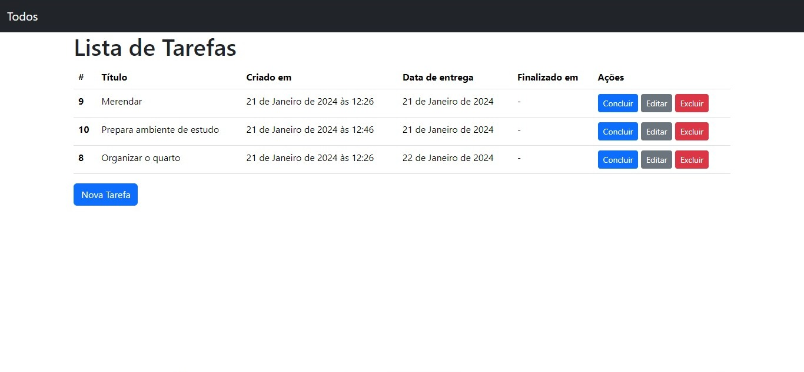
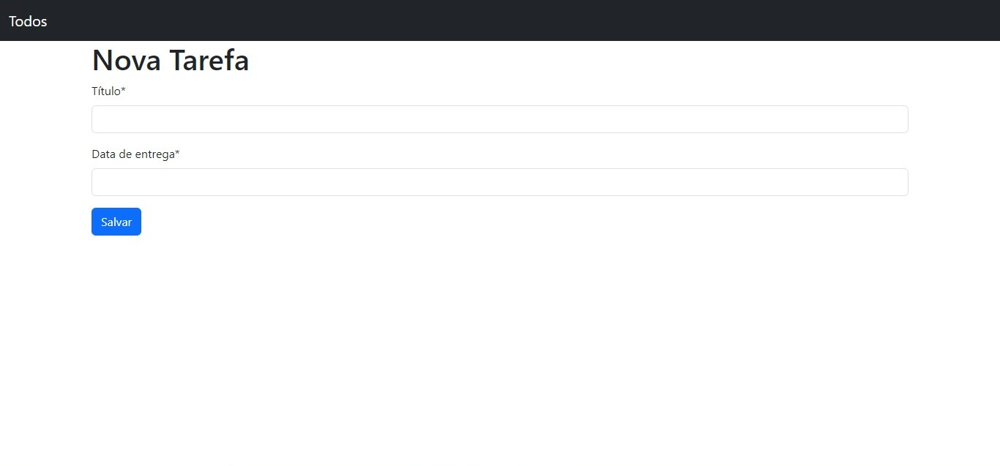
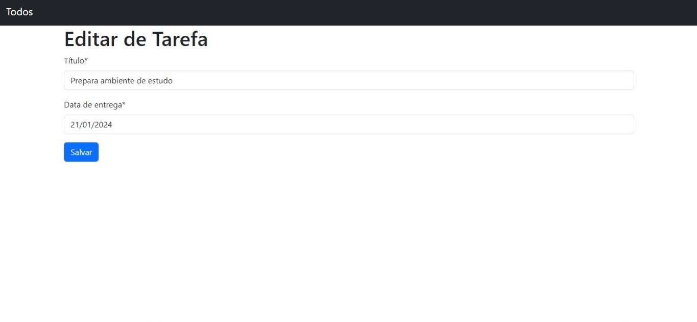
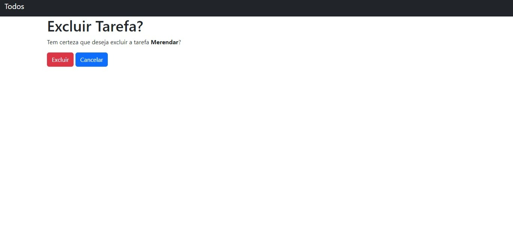
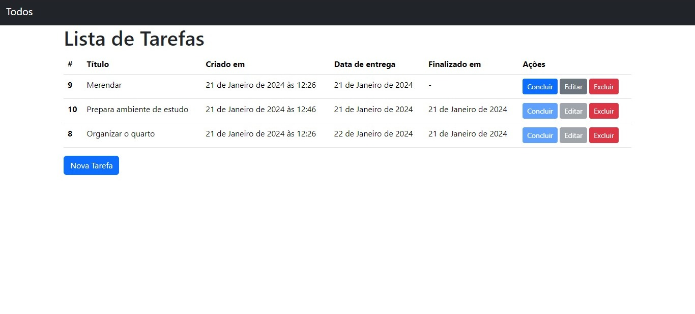

## Introdução ao Django

Criando uma Lista de Tarefas com Django

## Execute o comando para instalar as dependências:
- pip install -r requirements.txt

## Execute o comando para fazer a migração do banco de dados
- python manage.py migrate

## Subir projeto para visualização
- python manage.py runserver

## Projeto em execução

  

 

  

 

  

 

  

 

  

